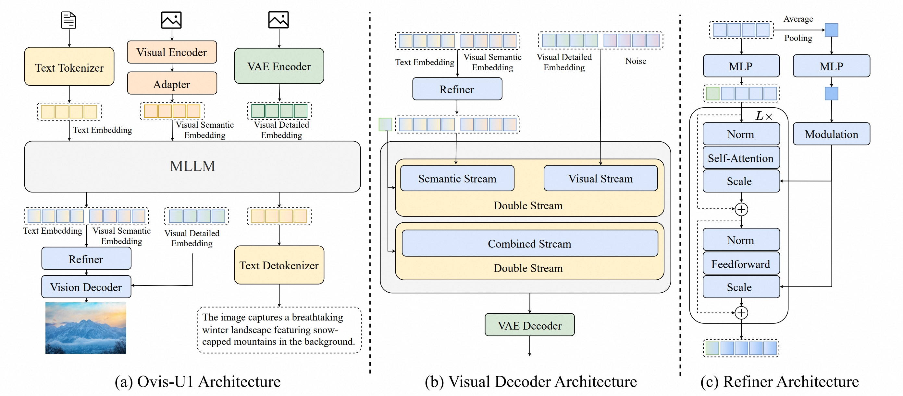

<p align="center">
</p>

<p align="center">
Ovis-U1: Unified Understanding, Generation, and Editing
</p>

<p align="center">
  <!-- <a href="https://arxiv.org/abs/2502.12579"></a> -->
  <a href="https://github.com/AIDC-AI/Ovis-U1"></a>
  <a href="https://huggingface.co/spaces/AIDC-AI/Ovis-U1-3B"></a>
  <a href="https://huggingface.co/AIDC-AI/Ovis-U1-3B"></a>
</p>

<p align="left">
Building on the foundation of the Ovis series, Ovis-U1 is a 3-billion-parameter unified model that  seamlessly integrates <b>multimodal understanding</b>, <b>text-to-image generation</b>, and <b>image editing</b> within a single powerful framework. 
</p>

<p align="center">
  
  <br>
  <em>The overall architecture of Ovis-U1 (cf. Fig.2 in our report).</em>
</p>

## 🏆 Highlights

*   **Unified Capabilities**: A single model excels at three core tasks: understanding complex scenes, generating images from text, and performing precise edits based on instructions.
*   **Advanced Architecture**: Ovis-U1 features a powerful diffusion-based visual decoder (MMDiT) and a bidirectional token refiner, enabling high-fidelity image synthesis and enhanced interaction between text and vision.
*   **Synergistic Unified Training**: Unlike models trained on single tasks, Ovis-U1 is trained on a diverse mix of understanding, generation, and editing data simultaneously. Our findings show that this approach achieves improved generalization, seamlessly handling real-world multimodal challenges with high accuracy.
*   **State-of-the-Art Performance**: Ovis-U1 achieves leading scores on multiple academic benchmarks, surpassing strong contemporary models in multimodal understanding (69.6 on OpenCompass), generation (83.72 on DPG-Bench), and editing (4.00 on ImgEdit-Bench).


## ✨ Showcase

Here are some examples demonstrating the capabilities of Ovis-U1.

<figure>
  
  <figcaption style="text-align: center;"></figcaption>
</figure>


## 🚀 News

- [2025/6/28] 🔥 Announcing Ovis-U1-3B ([Model](https://huggingface.co/AIDC-AI/Ovis-U1-3B), [Demo](https://huggingface.co/spaces/AIDC-AI/Ovis-U1-3B))!


## 📦 Installation

Ovis-U1 has been tested with Python 3.10, Torch 2.4.0, Transformers 4.51.3, and DeepSpeed 0.15.4. For a full list of package dependencies, please see `requirements.txt`.

```bash
git clone git@github.com:AIDC-AI/Ovis-U1.git
conda create -n ovis-u1 python=3.10 -y
conda activate ovis-u1
cd Ovis-U1
pip install -r requirements.txt
pip install -e .
```

## 🛠️ Inference

We provide simple scripts to test the different capabilities of Ovis-U1.

For multimodal understanding, please run

```bash
python test_img_to_txt.py
```

For text-to-image, please run
```bash
python test_txt_to_img.py \
    --height 1024 \
    --width 1024  \
    --steps 50 \
    --seed 42 \
    --txt_cfg 5  
```

For image editing, please run
```bash
python test_img_edit.py \
    --steps 50 \
    --img_cfg 4 \
    --txt_cfg 7.5  
```

Alternatively, you can try Ovis-U1 directly in your browser on [](https://huggingface.co/spaces/AIDC-AI/Ovis-U1-3B)


## 📊 Performance
#### OpenCompass Multi-modal Academic Benchmarks

| Model | MMB | MMS | MMMU | MathVista | Hallusion | AI2D | OCRBench | MMVet | Avg |
|:---:|:---:|:---:|:---:|:---:|:---:|:---:|:---:|:---:|:---:|
| GPT-4o | **86** | **70.2** | **72.9** | **71.6** | **57** | **86.3** | 82.2 | **76.9** | **75.4** |
| InternVL2.5-2B | 70.9 | 54.3 | 43.2 | 51.1 | 42.3 | 74.9 | 80.2 | 62.6 | 59.9 |
| SAIL-VL-2B | 73.7 | 56.5 | 44.1 | 62.8 | 45.9 | 77.4 | 83.1 | 44.2 | 61 |
| InternVL3-2B | 78 | 61.1 | 48.7 | 57.6 | 41.9 | 78.6 | 83.1 | <u>67</u> | 61.1 |
| Qwen2.5-VL-3B | 76.8 | 56.3 | 51.2 | 61.2 | 46.6 | 81.4 | 82.8 | 60 | 64.5 |
| Ovis2-2B | 76.9 | 56.7 | 45.6 | 64.1 | 50.2 | 82.7 | 87.3 | 58.3 | 65.2 |
| SAIL-VL-1.5-2B | 78.5 | 62.6 | 46.4 | 67 | 50 | 83.7 | **89.1** | 58.8 | 67 |
| Ristretto-3B | <u>80.2</u> | <u>62.8</u> | <u>51.3</u> | 67.6 | 50.2 | 84.2 | 84.7 | 60.7 | 67.7 |
| Ovis-U1 | 77.8 | 61.3 | 51.1 | <u>69.4</u> | <u>56.3</u> | <u>85.6</u> |  <u>88.3</u> | 66.7 | <u>69.6</u> |

#### GenEval

| Model | Single object | Two object | Counting | Colors | Position | Attribute binding | Overall |
|:---:|:---:|:---:|:---:|:---:|:---:|:---:|:---:|
| GPT-4o | <u>0.99</u> | 0.92 | <u>0.85</u> | 0.92 | 0.75 | 0.61 | 0.84 |
| BAGEL | <u>0.99</u> | 0.94 | 0.81 | 0.88 | 0.64 | 0.63 | 0.82 |
| BAGEL 📝 | 0.98 | 0.95 | 0.84 | <u>0.95</u> | <u>0.78</u> | **0.77** | <u>0.88</u> |
| UniWorld-V1 | <u>0.99</u> | 0.93 | 0.79 | 0.89 | 0.49 | 0.70 | 0.80 |
| UniWorld-V1 📝 | 0.98 | 0.93 | 0.81 | 0.89 | 0.74 | 0.71 | 0.84 |
| OmniGen | 0.98 | 0.84 | 0.66 | 0.74 | 0.40 | 0.43 | 0.68 | 
| OmniGen2 | **1** | 0.95 | 0.64 | 0.88 | 0.55 | <u>0.76</u> | 0.80 |
| OmniGen2 📝 | <u>0.99</u> | <u>0.96</u> | 0.74 | **0.98** | 0.71 | 0.75 | 0.86 |
| Ovis-U1 | 0.98 | **0.98** | **0.90** | 0.92 | **0.79** | 0.75 | **0.89** |

*📝 denotes using the rewritten prompts*

#### DPG-Bench

| Model | Global | Entity | Attribute | Relation | Other | Overall |
|:---:|:---:|:---:|:---:|:---:|:---:|:---:|
| BAGEL | **88.94** | **90.37** | **91.29** | <u>90.82</u> | <u>88.67</u> | **85.07** |
| UniWorld-V1 | 83.64 | 88.39 | 88.44 | 89.27 | 87.22 | 81.38 |
| OmniGen | 87.90 | 88.97 | 88.47 | 87.95 | 83.56 | 81.16 |
| OmniGen2 | <u>88.81</u> | 88.83 | <u>90.18</u> | 89.37 | **90.27** | 83.57 |
| Ovis-U1 | 82.37 | <u>90.08</u> | 88.68 | **93.35** | 85.20 | <u>83.72</u> |

#### ImgEdit-Bench

| Model | Add | Adjust | Extract | Replace | Remove | Background | Style | Hybrid | Action | Overall |
|:---:|:---:|:---:|:---:|:---:|:---:|:---:|:---:|:---:|:---:|:---:|
| GPT-4o | **4.61** | **4.33** | <u>2.9</u> | <u>4.35</u> | <u>3.66</u> | **4.57** | **4.93** | **3.96** | **4.89** | **4.2** |
| MagicBrush | 2.84 | 1.58 | 1.51 | 1.97 | 1.58 | 1.75 | 2.38 | 1.62 | 1.22 | 1.90 |
| Instruct-P2P | 2.45 | 1.83 | 1.44 | 2.01 | 1.50 | 1.44 | 3.55 | 1.2 | 1.46 | 1.88 |
| AnyEdit | 3.18 | 2.95 | 1.88 | 2.47 | 2.23 | 2.24 | 2.85 | 1.56 | 2.65 | 2.45 |
| UltraEdit | 3.44 | 2.81 | 2.13 | 2.96 | 1.45 | 2.83 | 3.76 | 1.91 | 2.98 | 2.7 |
| OmniGen | 3.47 | 3.04 | 1.71 | 2.94 | 2.43 | 3.21 | 4.19 | 2.24 | 3.38 | 2.96 |
| Step1X-Edit | 3.88 | 3.14 | 1.76 | 3.40 | 2.41 | 3.16 | 4.63 | 2.64 | 2.52 | 3.06 |
| ICEdit | 3.58 | 3.39 | 1.73 | 3.15 | 2.93 | 3.08 | 3.84 | 2.04 | 3.68 | 3.05 |
| BAGEL | 3.56 | 3.31 | 1.7 | 3.3 | 2.62 | 3.24 | 4.49 | 2.38 | 4.17 | 3.2 |
| UniWorld-V1 | 3.82 | 3.64 | 2.27 | 3.47 | 3.24 | 2.99 | 4.21 | 2.96 | 2.74 | 3.26 |
| OmniGen2 | 3.57 | 3.06 | 1.77 | 3.74 | 3.2 | 3.57 | <u>4.81</u> | 2.52 | <u>4.68</u> | 3.44 |
| Ovis-U1 | <u>4.13</u> | <u>3.62</u> | **2.98** | **4.45** | **4.06** | <u>4.22</u> | 4.69 | <u>3.45</u> | 4.61 | <u>4.00</u> |

#### GEdit-Bench-EN

|  Model | Background Change | Color Alteration   | Material Modification  | Motion Change | Portrait Beautification  | Style Transfer  | Subject Addition  | Subject Removal  | Subject Replacement  | Text Modification  | Tone Transformation  | Avg |
|:---:|:---:|:---:|:---:|:---:|:---:|:---:|:---:|:---:|:---:|:---:|:---:|:---:|
| GPT-4o | 7.205 |	6.491 |	**6.607** | **8.096** |	**7.768** |	<u>6.961</u> |	7.622 |	**8.331** |	**8.067** |	**7.427** |	**8.301** |	**7.534** |
| AnyEdit | 4.663	| 4.260 |	2.537 |	2.024 |	3.479	| 2.032 |	3.995 |	3.089 |	3.180 |	0.922 |	5.151 |	3.212 |
| Instruct-Pix2Pix | 3.825 |	5.182 |	3.688 |	3.509 |	4.339 |	4.560 |	3.461 |	2.031 |	4.237 |	0.955 |	4.733 |	3.684 |
| MagicBrush |	5.637 |	5.136 |	5.078 |	4.513 |	4.487 |	4.439 |	5.252 |	3.704 |	4.941 |	1.384 |	5.130 |	4.518 |
| OmniGen | 5.281 |	6.003 |	5.308 |	2.916 |	3.087 |	4.903 |	6.628 |	6.352 |	5.616 |	4.519 |	5.064 |	5.062 |
| Gemini |	6.781 |	6.369 |	6.040 |	6.938 |	5.591 |	4.676 |	7.501 |	6.447 |	7.003 |	5.765 |	6.350 |	6.315 |
| Step1X-Edit |	6.547 |	6.545 |	6.204 |	6.483 |	6.787 |	**7.221** |	6.975 |	6.512 |	7.068 |	<u>6.921</u> |	6.448 |	6.701 |
| Doubao |	<u>7.430</u> |	**7.095** |	6.339 |	<u>6.973</u> |	<u>6.972</u> |	6.767 |	<u>7.674</u> |	6.748 |	<u>7.447</u> |	3.471 |	<u>7.383</u> |	<u>6.754</u> |
| BAGEL | 7.324 |	<u>6.909</u> |	<u>6.381</u> |	4.753 |	4.573 |	6.150 |	**7.896** |	7.164 |	7.021 |	7.320 |	6.218 |	6.519 |
| Ovis-U1 | **7.486** |	6.879 |	6.208 |	4.790 |	5.981 |	6.463 |	7.491 |	<u>7.254</u> |	7.266 |	4.482 |	6.314 |	6.420 |

## 📚 Citation

If you find Ovis-U1 useful for your research or applications, please cite our technical report:

```bibtex
@inproceedings{wang2025ovisu1,
title={Ovis-U1 Technical Report},
author={Ovis Team},
year={2025}
}
```

## 🙏 Acknowledgments

The code is built upon [Ovis](https://github.com/AIDC-AI/Ovis) and [FLUX](https://github.com/black-forest-labs/flux). We thank their authors for open-sourcing their great work.

## 📄 License

This project is released under Apache License 2.0 (http://www.apache.org/licenses/LICENSE-2.0, SPDX-License-identifier: Apache-2.0).

## 🚨 Disclaimer

We used compliance checking algorithms during the training process, to ensure the compliance of the trained model to the best of our ability. Due to complex data and the diversity of language model usage scenarios, we cannot guarantee that the model is completely free of copyright issues or improper content. If you believe anything infringes on your rights or generates improper content, please contact us, and we will promptly address the matter.
